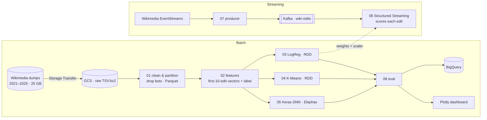

<div align="center">

# WikiFlow

**Predicting which new Wikipedia editors will quit, from 60 million revision events**


</div>

> **TL;DR:** Wikipedia depends on volunteers and keeps losing its newcomers. WikiFlow reads five years of English Wikipedia edit history on a Spark cluster, learns from each editor's **first 10 edits** whether they'll be gone within **6 months**, and scores the live edit stream in under a minute.

<br>

## Highlights

- **Batch + streaming, one feature schema.** The same per-editor features power both the offline models and a live Kafka → Spark Structured Streaming scorer (60-second trigger, under a minute end to end).
- **ML from scratch at scale.** Logistic regression (mini-batch SGD with `treeAggregate`) and K-Means (Lloyd's algorithm with broadcast centroids) are written directly on **Spark RDDs, without MLlib**.
- **Distributed deep learning.** A Keras network trained across Spark workers with **Elephas**, benchmarked against the from-scratch models.
- **Editor archetypes.** K-Means (k = 4) recovers *power editors*, *casual contributors*, *frustrated newcomers* and *bot-like accounts*.
- **Scaling experiment.** Runs on 2 vs 4 Dataproc workers to measure real distributed speed-up.

## Architecture



## Features that signal dropout

Following Halfaker et al. (2013), who showed early experience predicts retention:

| Signal | Why it matters |
|:--|:--|
| **Revert exposure** (`revision_is_identity_revert`) | Having your early edits undone is the strongest known discouragement |
| **Edit velocity and sessions** (gap > 30 min starts a new session) | Engagement rhythm |
| **Namespace mix** (articles vs talk vs user pages) | Whether someone is integrating into the community |
| **Bytes changed** (`revision_text_bytes_diff`) | Small fixes vs substantial contributions |

## Evaluation

Every job writes AUC-ROC, precision, recall, F1 and training time to `gs://…/metrics/` and to BigQuery table `wikiflow.results`. Silhouette is computed on a 50K-row sample, because the full calculation is O(n²).

| Model | AUC-ROC | F1 | Train time (2 → 4 workers) |
|:--|--:|--:|--:|
| Logistic regression (RDD, from scratch) | *target ≥ 0.75* | | *target ≥ 35% faster* |
| Keras DNN (Elephas) | *target ≥ LogReg* | | |
| K-Means (k = 4) | silhouette *target ≥ 0.35* | | |

## Repo layout

```
src/        01–08, one Spark job per file; inputs/outputs are CLI flags, all state in GCS
configs/    Dataproc init action, dump URL generator
docs/       Step-by-step GCP setup and job arguments (see docs/RUNBOOK.md)
report/     Final written report
presentation/  10-minute deck
```

## Run it

Everything runs from the GCP console, with no local cluster needed. Follow [`docs/RUNBOOK.md`](docs/RUNBOOK.md): create the bucket and ingest → start Dataproc with `configs/init_actions.sh` → submit jobs `01`–`05` and `08` → optionally run the live demo (`07` locally, `06` on Dataproc).

## What we'd do next

- Replace proxy features in streaming with **stateful per-editor windows** (`applyInPandasWithState`)
- Use **survival analysis** (time-to-dropout) instead of a fixed 6-month label
- Close the loop: surface high-risk newcomers to **mentorship programs** and measure the lift

<br>

<sub>Built by **Kunj Patel** and **Aryan Meena** · Boston University MET CS 777, Big Data Analytics, Spring 2026 · 📄 <a href="report/WikiFlow_Report.docx">Report</a> · <a href="presentation/WikiFlow_Slides.pptx">Slides</a></sub>
